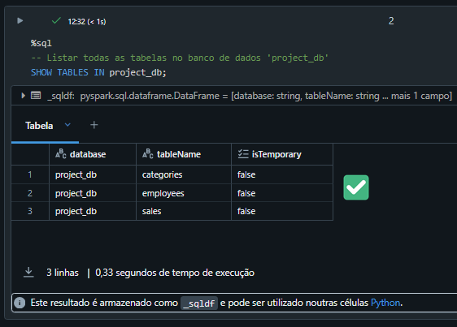

# Projeto Pipeline de Dados
 

Pipeline de dados para integrar informações provenientes de três fontes distintas (PostgreSQL, API e arquivo Parquet) em um banco de dados centralizado.

Para o desenvolvimento da solução escolhi ultilizar a cloud Azure em conjunto com Databricks para processar e orquestrar os dados, permitindo um ambiente gerenciado para processamento de dados em larga escala.
<br>
O pipeline foi organizado com a configuração de um datalake com três containers principais de armazenamento: **Landing**, **Processing** e **Curated**, cada um com funções e objetivos específicos.

### **Arquitetura do Projeto na Azure Data Bricks**
<br>

<br>
<a href="https://excalidraw.com/#room=f7be3512504dd27b3901,V1x9sfe8D3SXMXKaooKQYw" target="_blank" download>Acessar arquitetura no Excalidraw</a>


### **Camadas de Dados (Data Lake)**

- **Landing**: Armazenar os dados brutos extraídos das várias fontes JSON, CSV, ORC, Avro, XML e etc.
- **Processing**: Transformação e validação dos dados Parquet, Delta Lake, Avro, ORC e outros formatos otimizados.
- **Curated**: Guarda os dados prontos para consumo, otimizados e estruturados para análises.


## **Ferramentas e Tecnologias Utilizadas**

### **Databricks**

<br>


<br>

- **Motivo da Escolha**: Plataforma escalável para processamento distribuído em grande escala.
- **Benefícios**:
  - **Escalabilidade e Performance**: Processa grandes volumes de dados rapidamente.
  - **Ambiente Gerenciado**: Facilita a configuração e manutenção do cluster.
  - **Integração**: Integra-se facilmente com outras ferramentas do Azure, como Azure Data Lake e Power BI.

### **PySpark**

<br>


<br>

- **Motivo da Escolha**: Configuração inicial de acesso entre o cluster do Databricks e o Azure Data Lake Storage para montar e acessar os containers e ler arquivos no Data Lake Storage, aproveitando sua capacidade de manipular grandes volumes de dados.

### **Python e SQL**

- **Motivo da Escolha**: Ferramentas essenciais para ETL, manipulação e integração de dados.

### **Power BI**

- **Motivo da Escolha**: Ferramenta de Bi com integração com diversas fontes.

### **Versionamento com Git e Integração com Databricks**

- **Descrição**: O projeto foi versionado utilizando Git e GitHub permitindo conexão com Databricks para facilitar o desenvolvimento e a execução dos jobs.

<br>


- **Estrutura de pastas**:
    - `src/scripts/extraction`: Scripts de extração de dados.
    - `src/scripts/processing`: Scripts de processamento e limpeza de dados.
    - `src/scripts/loading`: Scripts de carregamento de dados na camada Curated.
    - `src/scripts/db`: Scripts de criação e gerenciamento do banco de dados.


## **Orquestração com Jobs no Databricks**

### **Descrição Geral**

O pipeline foi orquestrado utilizando notebooks versionados com GitHub. 
<br>
Cada etapa do pipeline foi representada por um notebook, organizado em pastas no repositório e agendado para execução diária.
<br>
Todos os jobs foram agendados para rodar diariamente as 5hrs, garantindo que os dados estejam sempre atualizados.

### **Estrutura dos Jobs**

<br>


<br>

1. **Job_Extract_Landing**: conexão com script python salvo no github para extrair dados das fontes originais e salvá-los na camada de "Landing".


2. **Job_Transform_Processing**: conexão com script python salvo no github para processar e transformar os dados extraídos, aplicando validações e salvando no container de "Processing".

3. **Job_Load_Curated**: conexão com script python salvo no github para carregar os dados processados no container "Curated" para o consumo final.


<br>

- Redução no tamanho dos arquivos otimizando as consultas 


<br><br>

4. **Job_Create_DB**: Criar um banco de dados no Databricks e criar as tabelas no banco de dados utilizando os dados do container "Curated".

```ruby
%sql
-- Criação do banco de dados 'project_db' caso ele ainda não exista
CREATE DATABASE IF NOT EXISTS project_db;

-- Deletar tabelas existentes antes de recriá-las
DROP TABLE IF EXISTS project_db.categories;
DROP TABLE IF EXISTS project_db.employees;
DROP TABLE IF EXISTS project_db.sales;

-- Tabela para armazenar dados de categorias salvos como parquet
CREATE TABLE IF NOT EXISTS project_db.categories
USING PARQUET
LOCATION '/mnt/curated/categories/';  -- Define o caminho onde os dados estão armazenados no DBFS

-- Tabela para armazenar dados de funcionários salvos como parquet
CREATE TABLE IF NOT EXISTS project_db.employees
USING PARQUET 
LOCATION '/mnt/curated/employees/';

-- Tabela para armazenar dados de vendas salvos como parquet
CREATE TABLE IF NOT EXISTS project_db.sales
USING PARQUET
LOCATION '/mnt/curated/sales/';
```

<br>

<br>

<br>

### **Execução dos Jobs**

<br>


## **Conexão com Power BI e Criação de Dashboards**

### **Passos Realizados**

1. **Disponibilização do Banco de Dados**
  - **Database**: O banco de dados criado no Databricks foi disponibilizado externamente para acesso por ferramentas de BI.

  - **Conexão**: Conectei o Power BI ao Azure Databricks permitindo a extração de dados.
    <br><br>
    
    <br><br>

  - **Modelagem**: Usei o Power Query do Power BI para organizar e modelar os dados em um Star Schema, facilitando análises rápidas e eficientes.
    <br><br>
    
    <br><br>

  - **Visualização**: Criei visualizações no Power BI, como gráficos e tabelas, para interpretar os dados e apoiar a tomada de decisões.
  - **Caminho do Dashboard no projeto**:
        - `/src/reports/Dashboard_Sales.pbix`: Dashboard_Sales.
    <br><br>
    <a href="https://drive.usercontent.google.com/download?id=1EAOJw0Nd5KarERpGTffMhbejotnebP3s&export=download&authuser=0&confirm=t&uuid=5c91d92f-0361-442d-9d9b-4bca014c6087&at=AO7h07fi18cJzESoogOVer0t-KDx:1725125025172" target="_blank">Baixar Power Bi</a>
    <br>
    
    <br><br>

<br><br><br>

## **Links e Referências**
1. **Documentação Apache Spark**: [https://spark.apache.org/docs/latest/](https://spark.apache.org/docs/latest/)
2. **Conectar-se ao Azure Data Lake Storage Gen2 e ao Armazenamento de Blobs**: 
[databricks/connect/storage/azure-storage](https://learn.microsoft.com/pt-br/azure/databricks/connect/storage/azure-storage)
# pipeline_dados_databriks
